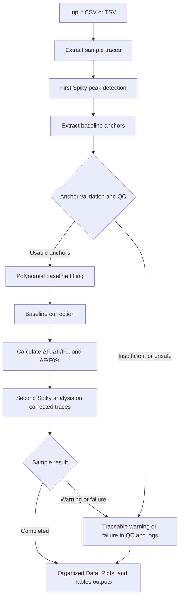

# Spiky Batch Macro

Spiky Batch Macro is a Fiji/ImageJ workflow for batch analysis of calcium-flux traces. It uses Spiky peak detection and adds validated polynomial baseline correction, conservative QC and failure handling, source-aware aggregate filenames, and an organized `Data/`, `Plots/`, and `Tables/` output structure.

This is research software. Review the generated QC records and plots before interpreting results.

## Requirements

- Fiji/ImageJ. The release was validated with ImageJ 2.16.0 / 1.54p.
- Windows is validated. Cross-platform use is expected but has not been fully validated.
- The packaged `Spiky.ijm`, included in the release ZIP.

Optional Spiky modules are not required by this batch workflow.

## Download

Normal users can download, extract, and use the latest release ZIP directly from the GitHub Releases page.

### Optional: verify the release download

Checksum verification is recommended when you want to confirm file integrity, reproducibility, or institutional auditability. Download the ZIP and its `.sha256` sidecar, then run:

```powershell
Get-FileHash -Algorithm SHA256 .\spiky_batch_v0.1.17_final_20260702.zip
Get-Content .\spiky_batch_v0.1.17_final_20260702.zip.sha256
```

The calculated ZIP hash should match the value in the sidecar. This check is optional and is not required for normal installation.

## Install

1. Extract the release ZIP.
2. Copy `Spiky.ijm` into the Fiji `macros/toolsets` folder.
3. Keep `Batch_Spiky_Baseline_Correction_v0.1.ijm` somewhere accessible.
4. Restart Fiji if it was open while installing Spiky.

## Input format

Open a CSV or TSV table in Fiji before starting the macro:

- column 1: time in seconds;
- columns 2 onward: one sample trace per column;
- unique sample headers, including 96-well names such as `A01` through `H12`, are supported;
- cells used for analysis must contain numeric values.

The deterministic 96-well synthetic dataset in `docs/validation/` is included as a public-safe example and stress test.

## Run

In Fiji, choose:

`Plugins > Macros > Run... > Batch_Spiky_Baseline_Correction_v0.1.ijm`

Select the open input table. Use **Full Batch** for the complete analysis and keep the validated default settings unless you understand and document the effect of changing them. **Dry Run** checks table detection and output setup without performing peak or baseline analysis.

## Workflow



## Outputs

Each run creates a timestamped output folder:

- run root: source-aware `<InputFileStem>_Batch_Master_Results.xml`, `Run_Log.csv`, and `Macro_Used_For_This_Run.ijm`;
- `Data/`: source-aware aggregate masters, `Analysis_Settings.txt`, publication-oriented `Method_Note.txt`, runtime records, and provenance verification;
- `Plots/`: sample and batch QC plots;
- `Tables/`: detailed per-sample tables.

Source-aware filenames prevent collisions when related datasets, such as pre/post measurements, are open together in Excel. External scripts should discover aggregate files by stable suffix (for example, `*_Final_Peak_Master.csv`) or use the exact paths in `Data/Analysis_Settings.txt`.

See [Output guide](docs/OUTPUT_GUIDE.md) for details.

## QC interpretation

- `Baseline_OK`: automated baseline checks passed; routine visual review is still required.
- `Baseline_Warning`: correction completed with one or more cautions. This is not automatically a failed sample.
- `Baseline_HighRisk`: correction completed but requires especially careful inspection before downstream use.

Some samples can fail traceably while a Full Batch run completes. Review `Run_Log.csv`, the sample summary, baseline reconstruction plots, and final peak plots. The software does not decide biological validity or replace scientific judgment.

See [QC interpretation](docs/QC_INTERPRETATION_GUIDE.md) and [Disclaimer](docs/DISCLAIMER.md).

## Known limitation

Very deep Windows paths can prevent older Excel configurations from opening an otherwise valid XML workbook. Use a short output parent such as `C:\Spiky_Output\`, or copy the XML file to a short local path before opening it.

## Validation summary

This release has undergone technical, workflow, packaging, and regression validation with ImageJ 2.16.0 / 1.54p on Windows. Cross-platform use is expected but has not been fully validated.

- A deterministic 96-well dummy stress-test dataset was used.
- The packaged Dry Run smoke test passed.
- The Full Batch dummy stress test passed: 96/96 samples processed, 59 final-output successes, 37 traceable conservative failures, and 526 final peaks.
- Excel open validation passed from a short Windows path.
- Package inventory, file-list, and hash checks passed.
- Scientific outputs remained unchanged after non-scientific release hardening, packaging, source-header, and interactive-menu polish, apart from expected timestamps, provenance, and paths.

Here, **validated** means technical, workflow, packaging, and regression validation. It does not mean universal biological ground-truth validation for every possible calcium waveform. Users remain responsible for reviewing QC outputs, plots, and biological plausibility. Intentional dummy-well failures are not defects; crashes, silent corruption, inconsistent aggregation, missing required files, or untraceable outcomes are release blockers.

See [Public release validation](docs/validation/PUBLIC_RELEASE_VALIDATION.md).

## Citation and attribution

Please cite this software release using [CITATION.cff](docs/CITATION.cff) or [CITATION.bib](docs/CITATION.bib).

Spiky is third-party GPL software. Please also cite:

Pasqualin C, Gannier F, Yu A, et al. *Spiky: An ImageJ Plugin for Data Analysis of Functional Cardiac and Cardiomyocyte Studies.* Journal of Imaging. 2022;8(4):95. [doi:10.3390/jimaging8040095](https://doi.org/10.3390/jimaging8040095).

See [NOTICE](NOTICE) for attribution details.

## License and support

This repository is licensed under GPL-3.0-or-later; see [LICENSE](LICENSE). Report non-sensitive bugs through GitHub Issues after the repository is public. Do not upload private, identifiable, or unpublished experimental data to a public issue.
